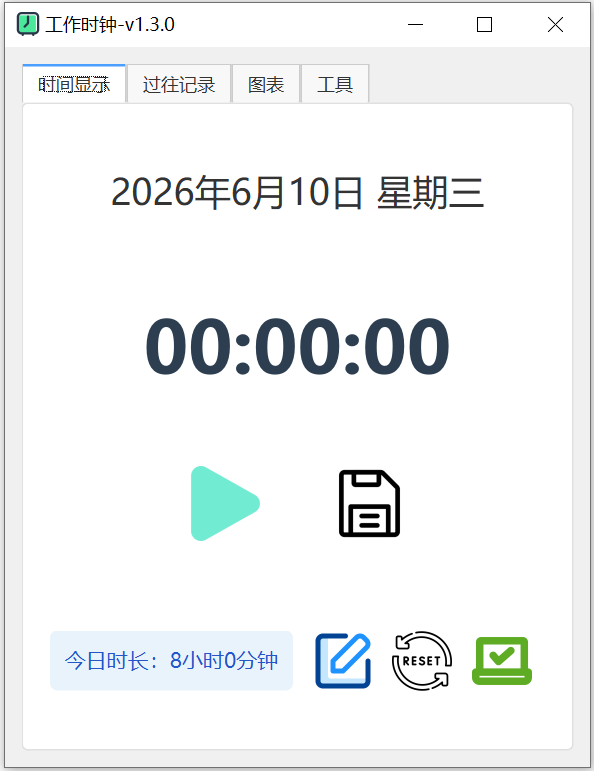

# Qt时钟工具



## 功能介绍
一个基于Qt6开发的桌面时钟工具，通过手动的开启和关闭一个正向的计时器，
记录每次工作的时长，保存在本地数据库文件中，按日查看记录。

## 版本更新记录
### v1.0.0(2026-02-14)
- 支持基础日期/时间显示
- 目标时间设置

### v1.0.1(2026-02-15)
- 修复：周日日期显示时QList越界崩溃的问题
- 优化：添加单实例限制，避免多开程序

### v1.1.1(2026-02-16)
- 新增：过往记录可直接查看文本文档

### v1.1.2(2026-02-18)
- 优化：本次保存的记录也会直接刷新到展示页面

### v1.1.3(2026-02-27)
- 新增：调整按钮可以增加今日记录的时间

### v.1.2.0(2026-03-10)
- 移除：今日目标设置
- 新增：调整按钮可增加或减少今日时间
- 优化：显示页面优先显示底部最新记录

### v.1.2.1(2026-03-13)
- 新增：显示过去7天和30天的平均时长(不含空缺天数)

### v.1.2.2(2026-03-14)
- 优化：时钟暂停和运行中的状态分界更清晰

### v.1.2.3(2026-04-07)
- 新增：常用工具页面

### v.1.2.4(2026-04-23)
- 新增：上次操作时间

### v.1.3.0(2026-06-04)

- 新增：自定义每日目标、打卡功能与记录展示
- 优化：文本文件改用sqlite数据库存储
- 优化：展示页面更改为表格
- 优化：更新样式表

### v.1.3.1(2026-07-06)

- 新增：图表页面展示,每日,周均,月均tab页面

## 源码编译

```bash
# 配置 CMakePresets.json 中 qt6 安装路径后
cmake --preset release					# 创建build目录并配置项目
cmake --build build/release -j 16		# 并行构建项目
```

##### 待更新：

1. 快捷键唤出
1. 图标代理优化ai写法
1. 每月汇总图表
